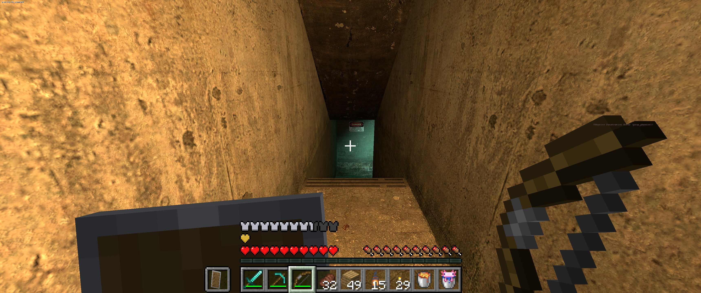

# HalfCraft

<p align="center">
  
</p>

Play Half-Life 2 with Minecraft. Real Minecraft (26.3 with the Fabric mod in `minecraft/`) runs
hidden and does the player's physics, inventory, blocks and combat math; Half-Life 2 renders and
runs its world, NPCs and scripts around it. Build on Half-Life's maps, fight its NPCs with a
diamond sword, light City 17 with torches.

The two games talk over shared memory (`protocol/halfcraft_protocol.h`). Half-Life 2's game code
is open source (Source SDK 2013), so the Half-Life side is a regular Source mod with a handful of
hooks into Valve's code.

It runs on either of two engines, from the same code:

| Engine id | Engine | Built from |
|---|---|---|
| `hl2` | Half-Life 2's own (`hl2.exe`, 32-bit): Half-Life 2 is all a player needs | Valve's singleplayer SDK as of 2015 (`source-sdk-2013-sp`), patched to build with today's Visual Studio |
| `hl2dm` | Half-Life 2: Deathmatch's (`hl2mp_win64.exe`, 64-bit, more memory) | [hl2dm-sp](https://github.com/hardlightbridge/hl2dm-sp): Valve's 2025 SDK with the campaigns running on that engine (`source-sdk-2013`) |

Each engine gets its own game folder (`game-hl2`, `game-hl2dm`): their saves don't mix. Minecraft's
world is the same.

Half-Life 2, Episode One and Episode Two are one game, the way Valve's `hl2_complete` (what Steam
starts Half-Life 2 as now) is: the episodic client and server run all three campaigns, the episodes'
content is mounted over Half-Life 2's, and New Game lists all chapters, numbered on (Half-Life 2's
1-14, Episode One's 15-19, Episode Two's 20-26), all unlocked from the start. Each campaign keeps its
own skill values (`source/src/server/hc_campaign.cpp`). Lost Coast, which Half-Life 2 installs into
its folder, is chapter 27. Its content is mounted last, so its copies of shared files don't cover the
campaigns'. On its map, `source/src/server/hc_lost_coast.cpp` loads its own `scenes.image`. Episode
Two's `blackout.mdl`, the first-person knockout rig, has none of the animations Half-Life 2, Episode One
and Lost Coast play on it (Half-Life 2's d1_trainstation_04 and Lost Coast's intro wait for its get-up),
so off Episode Two's maps `source/src/server/hc_blackout.cpp` puts Episode One's, which has them all,
first. The game folders are put together by `tools/engines.ps1` from hl2dm-sp's campaign folders.

## Layout

```
minecraft/       the Fabric mod (Java): Minecraft's side of the link, its exporters and physics hooks
source/          the Source mod (C++)
  src/core/        engine-agnostic: shared memory link, coordinates, tick interpolation, collision streamer
  src/client/      client.dll: host state, input, camera, Minecraft overlay, blocks, entities, particles, lights, water
  src/server/      server.dll: Half-Life's collision as Minecraft geometry, block collision, combat, health, hazards
  src/shared/      the hook entry points, the puppet movement (CGameMovement::HalfCraftMove), the client/server bridge
  sdk/             halfcraft-<engine>.patch: the hooks into Valve's game code, one per SDK tree
  mod/             files laid over the game folders: common/ (cfg), hl2/ and hl2dm/ (gameinfo.txt)
  launcher/        HalfCraft.exe: a release's one click (finds Steam's games, starts Minecraft, then the mod)
  halfcraft_*.vpc  pulled into Valve's client/server projects
protocol/        the shared memory layout, the one source of truth for both sides
package/         what a release carries besides code: the Prism instance template, the players' README
tools/           setup, build, run and packaging scripts, link and crash-dump debugging helpers
Makefile         the tasks, wrapping tools/
```

## How it maps

| | |
|---|---|
| Scale | 1 block = 40 units: Minecraft's player is 72 units tall with eyes at 64.8, Source's is 72 / 64 |
| Axes | source (x, y, z) = minecraft (x, -z, y); yaw: `mc = -source - 90` |
| Maps | each map gets its own 1024-block slot along x (`map_slot`), so builds stay on their map. Every level load (a map change, a transition, a save, also of the same map) starts a new collision epoch, so Minecraft drops what it had and gets the doors and lifts where they are now, and its player goes where Source's is |
| Saves | Half-Life's saves roll Minecraft back too: each save carries a checkpoint id (a logical entity saved with the level); saving keeps Minecraft's changed blocks and its player (inventory, armour, health, hunger, experience, effects) under it, loading a save puts them back and clears dropped items, arrows and lit TNT. Any save, in any order; level transitions leave Minecraft alone. A new game from the menu starts a playthrough: each map it enters for the first time (the new game's own, then each one a level transition brings up) goes back to how it was before anything was built there, dropped items, frames, armour stands and empty boats go, and the new game heals and feeds the player, who keeps everything they carry. A `map` typed into the console starts none |
| Player | Minecraft's position rides in the user command (`CUserCmd::hc_origin`), so server and client prediction agree. Source takes the player (and the keyboard) for what Minecraft can't do: ladders (G looking at one, or walking into one with W, mounts it the way Half-Life does), lifts and trains while they move, vehicles, scripted cameras; meanwhile Minecraft's player goes wherever Source's is (no fall damage from a ride), and Minecraft picks up where Source leaves the player. Minecraft's own teleports (ender pearls, chorus fruit, which lands on Half-Life's floors, `/tp`) take Source's player along wherever it fits; one that leaves the player in a ceiling, a ledge or a wall (a pearl that hit it) lands both under, onto or out of it nearby, and refused ones put Minecraft's back. Source's pushes (trigger_push, conveyors, point_push) move Minecraft's player too, its shoves (a trigger_push that pushes once, an antlion guard, a cop's stunstick) give it momentum, the ground's material reaches the map's surface triggers (the coast's antlion sand), Half-Life's floors sound their own footsteps under it (Minecraft's blocks keep Minecraft's), and player_speedmod (a dazed walk, the G-Man's last scene) slows Minecraft's walking without zooming its view. Crouching is Half-Life's duck: 0.9 blocks tall with the eyes at 0.7 (Source's ducked hull), so vents and crawlspaces fit, Half-Life's ceilings keep the player crouched, and crouching in the air pulls the legs up (the duck jump) where there's room for them |
| Camera | Minecraft's camera: its eye, FOV and walk bob; F5 puts the view behind the player (or in front, looking back) at Minecraft's own zoom distance, which already stops at Half-Life's walls, and draws the player's body (Minecraft's own model, skin, armour and held items) at the interpolated feet. On ladders, rides and in vehicles F5 still reaches Minecraft and moves Source's own view (the airboat's seat) back the same way, with the body under it; in a vehicle it sits as in a Minecraft boat, facing the seat, and the vehicle itself doesn't stop the camera |
| Health | Minecraft owns the player's health while its player is in its world (on ladders and rides too): every Half-Life hit goes to it, and its health and absorption are mirrored onto Half-Life's player, so health kits, wall chargers, suit batteries and medics work as usual; what they add goes back to Minecraft (health heals, suit armour becomes absorption, x1/5 like damage) |
| Collision | world brushes (engine planes, player clips included), displacements, static props and solid entities, streamed in 8x8x8-block regions; moving doors and lifts are re-sent while they move |
| Blocks | each 16x16x16 section Minecraft meshes becomes a Source renderable (atlas as a point-sampled procedural texture, lit by the map's lightmaps plus block light), and an invisible `halfcraft_blocks` entity whose traces and static physics stop NPCs, bullets and props |
| Things | dropped items, arrows, tridents, block cracks and the targeted block's outline (Minecraft's world entities), plus whatever its entity renderer and particle engine draw (lit TNT, falling blocks, minecarts, chests, particles, with their entity textures); soft shadows under mobs; Minecraft arrows that stick in NPCs stay on the bone they hit and follow their ragdolls. One renderable rebuilt every frame, lit like the blocks |
| Light | Minecraft's torches, lava and glowstone become Source lights. The nearest ones (`hc_torch_light_count`, default 4) are point lights made of six shadow-casting projected textures (Source's flashlight, one per cube face, cross-faded at the seams) that light the map and its characters per pixel in their colour; the next ones light only characters; `hc_torch_light` sets the brightness |
| Water | Half-Life's water and slime around the player go to Minecraft as a surface height per block column, so Minecraft swims, floats and drowns in them. Boats and fishing bobbers away from the player get small grids of their own, and so do mobs and dropped items off the player's grid within 48 blocks (12 at once: boats and bobbers first, then mobs, then items, the nearest of each), and a boat waits for its grid before it falls onto water nobody has looked at yet. Boats go onto Half-Life's water from the hand and from a dispenser as onto Minecraft's |
| Combat | NPCs and breakable props near the player become Minecraft's invisible stand-ins; Minecraft's hits come back as Half-Life damage (`hc_damage_to_npc`, default 3; on ladders, rides and in vehicles too), Half-Life's hits on the player go to Minecraft's health (it divides by 5: 100 hp -> 20), Minecraft's death kills Gordon, TNT and creepers explode in Half-Life too (`hc_explosion_damage`), Half-Life's grenades, rockets and barrels break Minecraft's blocks the way TNT does and its bullets break glass, panes and ice, Minecraft's fire and lava set NPCs alight and magma stings them |
| Mobs | Minecraft's mobs path over Half-Life's maps with Minecraft's own pathfinding, which reads the streamed collision: its floors, walls between cells and railings (mobs don't jump them); Half-Life's walls block their sight, its roofs keep undead from burning (its sky doesn't: the skybox ceiling counts as open sky, as it does for a beacon's beam), pets teleport onto its floors, and mobs hold still while a level load restreams the ground under them. Monsters and your pets near the player get invisible `halfcraft_mob` stand-ins that Half-Life's characters see by their own relationships (monsters as zombies, pets as the player's allies): the Combine shoot monsters, which fight back, and a pet's bite is blamed on the pet |
| Input | everything goes to Minecraft except the console, Esc (when no Minecraft screen is open), F6/F7/F9/F10, Source's use (G, or whatever key Half-Life's keyboard options bind to it) and V (flashlight). Carrying a prop picked up with use, the left mouse button throws it and the right one drops it; it's left out of Minecraft's collision meanwhile. On ladders and rides Source has the keyboard, but the mouse buttons, the wheel and the hotbar keys stay Minecraft's, and a screen they open there (a chest, a crafting table) has the keyboard and mouse until it closes |
| Weapons | Half-Life's weapons are Minecraft items, one per weapon the player owns: Source's inventory decides, so what it picks up appears in the hotbar and what a map takes away goes (saves too); the items can't be dropped or put into containers. Holding one takes the weapon out in Half-Life (anything else in the hand puts it away), and while it's out the mouse buttons fire and alt-fire it and R reloads it; Half-Life's viewmodel replaces Minecraft's hand in first person, and the item's bar, its tooltip and the action bar show the ammo. When the weapon out runs dry (the last grenade thrown), Half-Life switches to the next one as it does and the hand follows it on the hotbar; a scene that keeps the weapons away (player_speedmod) keeps the hand's away too. The gravity gun tears Minecraft's blocks out of builds within its reach (pulled or punted; whole cubes without a block entity, softer than obsidian): a physics cube with the block's faces that sounds and weighs like its material, which turns back into the block where it comes to rest, like falling sand, or drops as an item without room |

## Build and run

Needs Visual Studio 2022+ (C++ desktop workload with its x64 and x86 tools), Python 3, Git, GNU
make 4+ (`winget install ezwinports.make`), JDK 25, a Minecraft: Java Edition account, and on Steam:
Half-Life 2 (plus Half-Life 2: Deathmatch for the `hl2dm` engine).

```powershell
make setup                   # clones both SDK trees into the repo (git-ignored) and applies the patches
make build                   # both engines' dlls and shaders, game folders build/game-<engine>, HalfCraft.exe
make mc-run                  # the Minecraft dev client (finds a JDK 25 itself); waits for the game
make run ENGINE=hl2 MAP=d1_trainstation_02
```

`make format` formats the C++ with clang-format 22 and `make lint` checks it; a compiler warning in
HalfCraft's own C++ or Java fails its build.

`make` alone lists the tasks; `ENGINE=hl2` or `ENGINE=hl2dm` limits one to an engine (`make run`
defaults to `hl2dm`; the `hl2` build takes its shaders and campaign files from `source-sdk-2013` too,
so its setup clones both trees). After changing Valve code inside an SDK tree, `make patches` writes
it back into `source/sdk`.

Minecraft waits on its title screen, then hides its window and loads its mirror world once the
game is up.

A release is one command:

```powershell
make package                 # builds both halves -> dist/HalfCraft-<version>.zip (+ -pdb.zip)
```

The zip's `HalfCraft` folder holds `HalfCraft.exe`, the two game folders (`game-hl2/`,
`game-hl2dm/`) and a portable Prism Launcher with the HalfCraft instance (`minecraft/`);
`package/README.txt` is what players read. `HalfCraft.exe` checks Steam has Half-Life 2, asks which
engine to run when Half-Life 2: Deathmatch is installed too (and remembers it; Shift asks again),
starts Minecraft through Prism (the first time it waits for the Microsoft sign-in), then the
engine on its game folder. `client.dll` starts
Minecraft too when nothing else did, and again if it quits on its own, and says on screen what
it's doing until it connects. Prism Launcher and Fabric API downloads are pinned by hash.

Versions come from git tags: a commit tagged `vX.Y.Z` is release X.Y.Z, and the N commits after it are
`X.(Y+1).0-dev.N+<commit>` (`tools/version.ps1`; the mod, `HalfCraft.exe` and the zip all carry it). CI
(`.github/workflows`) checks every push: clang-format, the Minecraft mod's build and tests, both
engines' build and the zip. Each push to `main` replaces the `dev` pre-release on GitHub, and a pushed
tag `vX.Y.Z` publishes that release.

Console variables: `hc_block_light` (block brightness in the map's light, default 2 = Source's
overbright), `hc_torch_light` / `hc_torch_light_count` (Minecraft's lights on the map),
`hc_damage_to_npc`, `hc_explosion_damage`; for debugging `hc_debug_blocks 1` (outline the blocks'
collision), `hc_debug_drop 1` (drop a watermelon onto the blocks), `hc_debug_use 1` (log what use
finds), `hc_debug_torch` (a torch light where you look, without Minecraft), `hc_debug_voxels [regions]` (Minecraft's
collision voxels around the player checked against Source's own collision), and the commands `hc_look <pitch> <yaw>`, `hc_click <1|2|3>`, `hc_scroll <notches>`, `hc_press <key> <1|0> [seconds]` (a key or mouse button the way the real one goes, so a weapon held in Minecraft fires) and `hc_weapons` (the player's weapons as Minecraft gets them). `make cmd C="'save test' 'load test'"`
sends console commands to the running game, and `python tools/read_dump.py <dump> <folder with the pdbs>`
names where a crash dump died: `build/game-hl2/bin` for `hl2.exe`, `build/game-hl2dm/bin/x64` for
`hl2mp_win64.exe` (Steam keeps the dumps in `Steam/dumps`).

Tests that change things play apart from your own games. `make test-start` sets the game folders'
saves and `config.cfg` aside, then `make mc-test` starts a Minecraft dev client with a run folder
(`minecraft/run/test`) and a world (`HalfCraftTest`) of its own; quit both games before
`make test-stop` puts your saves and settings back (`tools/test_session.ps1`). Neither client starts
while another Minecraft runs (they'd share the link), the test client only in a test session and
yours only outside one. In the game, `hc_mc <command>` runs a Minecraft command as the player (the
answer goes to chat and to Minecraft's log). For scripts (`tools/hl2_command.ps1`; typed into the
console they're let go as it closes), `hc_key <SDL scancode> [1|0] [seconds]`,
`hc_hold <mouse button> <1|0> [seconds]` and `hc_use <1|0> [seconds]` press Minecraft's keys and
buttons and Source's use, and `tools/wait_log.ps1` waits for a line in either game's log.

## Not done yet

- multiplayer

## Credits

HalfCraft is based on [SkyCraft](https://github.com/chasmlol/SkyCraft) by chasmlol, which plays
Skyrim the same way. The Minecraft mod, the shared memory protocol and much of the Source side's
design (the link, the collision streamer, tick interpolation, the world renderer's entities) come
from it, under the MIT license (see `LICENSE`).

HalfCraft isn't affiliated with or endorsed by Valve, Mojang or Microsoft. See
`THIRD-PARTY-NOTICES.md` for what it's built from.
